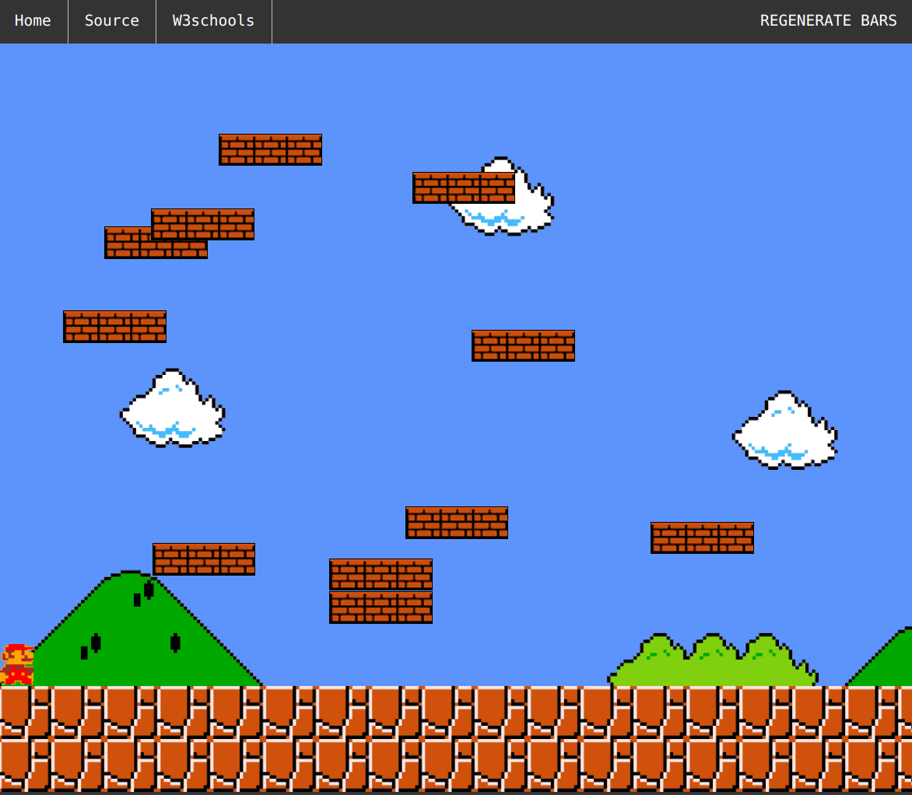

# touch-mario

## Demo

<a href="https://woolimi.github.io/touch-mario" target="_blank">https://woolimi.github.io/touch-mario</a>

## Overview

My first personal web project when I first learned html, css javascript.

Use the arrow keys to move Super Mario to the top menu bar, then you can go to another link.
